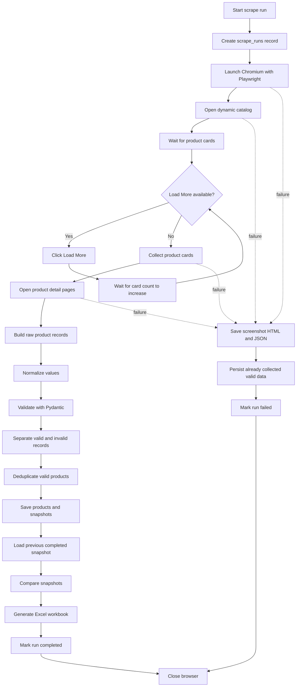
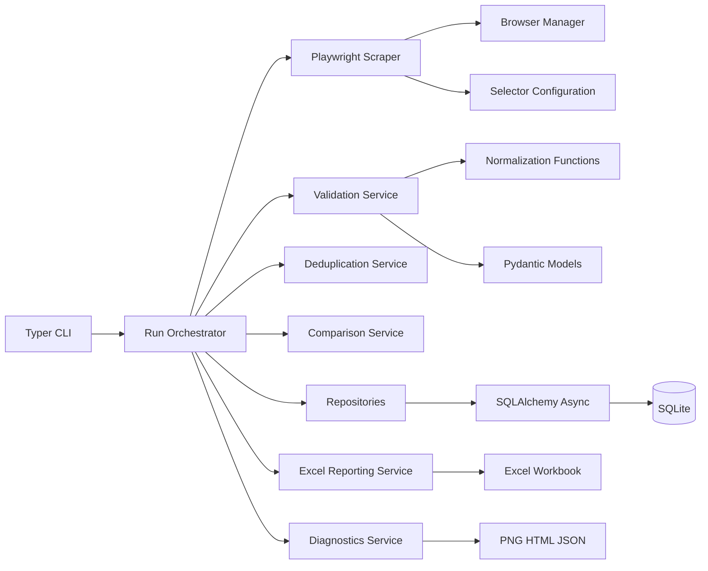
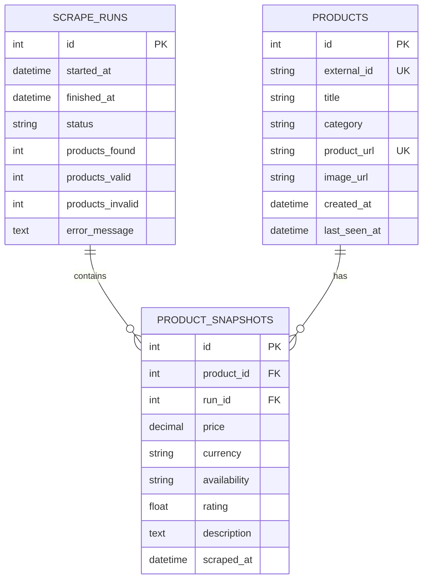
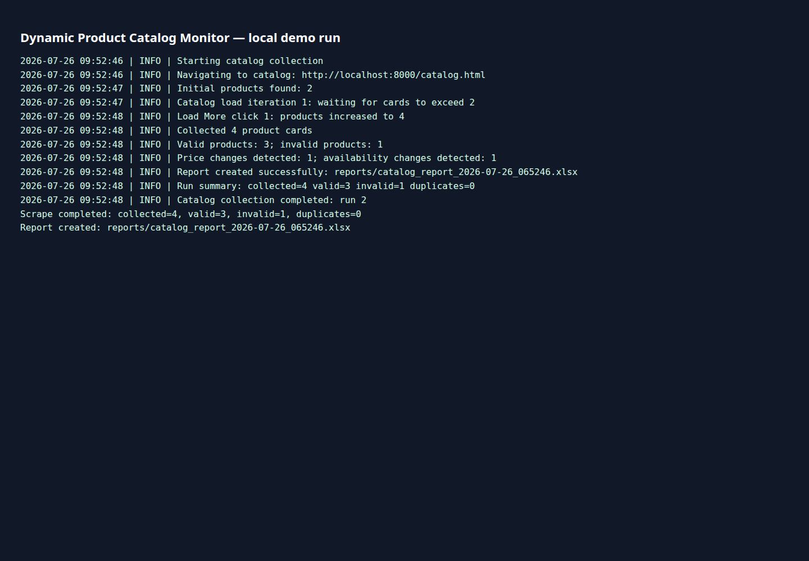
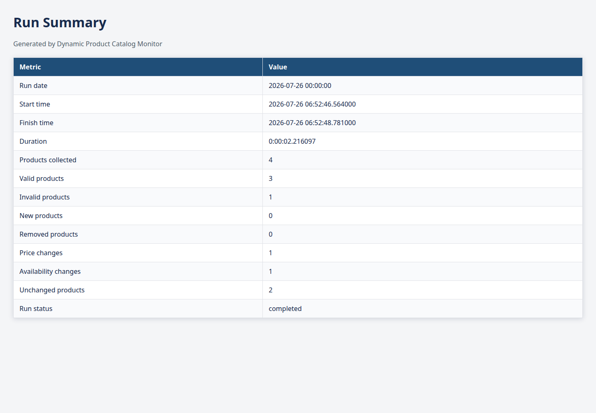
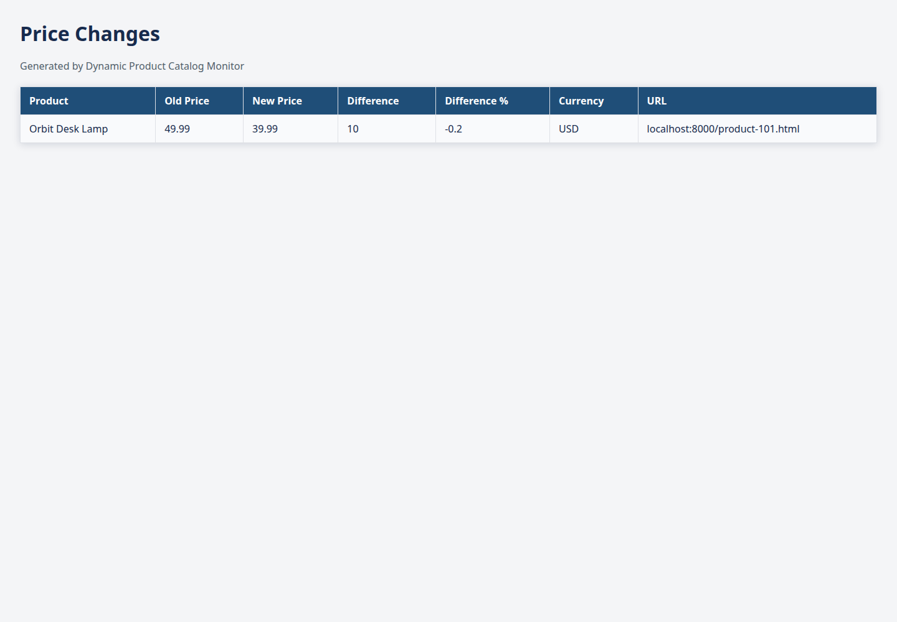

# Dynamic Product Catalog Monitor

Dynamic Product Catalog Monitor is a Python 3.12 application for collecting a
JavaScript-rendered product catalog, storing run snapshots, detecting catalog
changes, and producing a formatted Excel report.

It is designed as a small, extensible MVP: scraping, normalization, validation,
persistence, comparison, reporting, and diagnostics are deliberately separate
layers.

## Project overview

Catalogs change constantly: products are added or removed, prices move, and
availability changes. Checking them manually is slow and makes it easy to miss
important changes. This project records a catalog at a point in time, compares
the latest completed run with the preceding completed run, and makes the result
available in both the CLI and an Excel workbook.

## Features

- Asynchronous Playwright/Chromium collection for dynamic catalogs.
- Bounded **Load More** handling with condition-based waits.
- Card extraction with conservative, sequential detail-page enrichment.
- Pydantic validation and normalization for prices, currency, ratings,
  availability, text, and URLs.
- Deterministic product deduplication.
- Async SQLAlchemy persistence with SQLite for the MVP.
- Snapshot comparison for new and removed products, price changes, and
  availability changes.
- Formatted multi-sheet Excel reports.
- Failure diagnostics: screenshot (optional), HTML, and structured JSON.
- Typer CLI, Docker support, unit tests, and an opt-in end-to-end workflow test.

## How the application works



The first successful run has no baseline, so every valid current product is
reported as new. Failed runs are never used as the comparison baseline.

## Architecture



### Data model

Products hold stable identity and descriptive fields. A product snapshot stores
the fields observed during one run, so comparisons can use historical price and
availability values.



The physical `products` table also stores a normalized product URL, used as a
unique fallback identity when an external ID is unavailable.

### Example comparison result

```text
New products: 8
Removed products: 3
Price changes: 12
Availability changes: 5
Unchanged products: 146
```

Example price change, represented conceptually as JSON:

```json
{
  "product_id": "product-124",
  "field": "price",
  "old_value": 1299.99,
  "new_value": 1199.99,
  "change_percent": -7.69
}
```

## Project structure

```text
app/
  scraper/       Playwright lifecycle, selectors, catalog loading and extraction
  services/      Normalization, validation, deduplication, comparison, reports,
                 and run orchestration
  db/            Async SQLAlchemy setup, schema, and repositories
  utils/         Logging and failure diagnostics
  config.py      Pydantic settings loaded from .env
  models.py      Application-level Pydantic domain models
  main.py        Typer CLI
tests/           Unit tests, fixtures, and opt-in end-to-end coverage
data/            SQLite database location by default
reports/         Generated .xlsx workbooks
diagnostics/     Failure artifacts
```

## Installation

Use Python 3.12 or newer (within the project's supported Python range).

```bash
git clone <your-repository-url>
cd dynamic-catalog-monitor
python -m venv .venv
source .venv/bin/activate
python -m pip install --upgrade pip
python -m pip install -e ".[dev]"
```

On Windows PowerShell, activate the virtual environment with:

```powershell
.venv\Scripts\Activate.ps1
```

### Playwright browser installation

Install the Chromium browser used by Playwright after installing the Python
dependencies:

```bash
python -m playwright install chromium
```

On a Linux workstation or CI image that needs system browser dependencies, use:

```bash
python -m playwright install --with-deps chromium
```

## Environment configuration

Copy the example file and replace the catalog URL with a site you are authorized
to monitor:

```bash
cp .env.example .env
```

`.env.example`:

```dotenv
CATALOG_URL=https://example.test/catalog
HEADLESS=true
MAX_LOAD_MORE_CLICKS=20
PAGE_TIMEOUT_MS=30000
OUTPUT_DIR=reports
DATABASE_URL=sqlite+aiosqlite:///data/catalog.db
SAVE_FAILURE_SCREENSHOTS=true
LOG_LEVEL=INFO
```

Additional supported settings are `DIAGNOSTICS_DIR` (defaults to `diagnostics`)
and `MAX_ITEMS` (optional positive limit). `OUTPUT_DIR` and `DIAGNOSTICS_DIR`
are filesystem paths; the SQLite URL is suitable for local development and MVP
deployments.

## CLI commands

Use either `python -m app.main` or, after installation, the
`dynamic-catalog-monitor` console script.

```bash
# Show command help
python -m app.main --help

# Run the complete collection workflow
python -m app.main scrape

# Show the browser while scraping
python -m app.main scrape --headful

# Limit card collection for a run
python -m app.main scrape --max-items 100

# Override configuration for one run
python -m app.main scrape \
  --catalog-url https://example.test/catalog \
  --output-dir custom-reports

# Compare the two most recent completed runs without scraping
python -m app.main compare

# Compare and create a comparison report
python -m app.main compare --export --output-dir custom-reports

# Recreate the latest completed run's report
python -m app.main export

# Export to a directory or a new explicit workbook path
python -m app.main export --destination custom-reports
python -m app.main export --destination custom-reports/latest.xlsx
```

`compare` requires two completed runs. `export` works with one completed run;
when no prior completed run exists, the latest products are treated as new. An
explicit `.xlsx` destination must not already exist, preventing accidental
overwrites.

## Excel report structure

Reports are written to `reports/catalog_report_YYYY-MM-DD.xlsx` by default. If
that name is already present, a time suffix is appended. Every sheet has a bold
header, frozen first row, filters, wrapped text, readable URL hyperlinks, and
appropriate timestamp, currency, or percentage formatting.

| Worksheet | Contents |
| --- | --- |
| **All Products** | Valid products from the current run, including identity, price, availability, rating, description, links, and scrape time. |
| **New Products** | Current products that were not found in the previous completed snapshot. |
| **Price Changes** | Product name, old and new price, absolute and percentage difference, currency, and URL. |
| **Availability Changes** | Product name, previous and current availability status, and URL. |
| **Removed Products** | Products from the prior completed run that are absent from the current completed run, with their last known values. |
| **Invalid Records** | Raw product values that failed validation, plus a human-readable reason and structured error details. |
| **Run Summary** | Timing, collection and validation counts, comparison counts, and final run status. |

## Testing

The normal test command excludes tests marked `integration`:

```bash
python -m pytest
python -m pytest -m integration
python -m pytest --cov=app
python -m ruff check .
python -m ruff format --check .
python -m mypy app
```

Equivalent convenience targets are available:

```bash
make test
make test-integration
make coverage
make lint
make format-check
make typecheck
make quality
```

Unit tests use local fixtures and fakes; they do not require a live website.
The opt-in end-to-end test uses deterministic fixture data, a temporary SQLite
database, and a temporary report directory. Tests that launch a real Chromium
browser should be marked `@pytest.mark.integration`.

## Docker usage

Build the image and display CLI help:

```bash
docker compose build
docker compose run --rm monitor
```

Run a collection by overriding the Compose command:

```bash
docker compose run --rm monitor python -m app.main scrape
```

Compose reads `.env` when present and mounts `data/`, `reports/`, and
`diagnostics/` so database records, reports, and diagnostic artifacts survive
container removal. The image installs Chromium and its required system
dependencies during its build.

## Diagnostics and error handling

The orchestrator creates the database run record before browser navigation. If
navigation, loading, card collection, or detail extraction causes a run-level
failure, it logs the error, preserves valid products collected up to that point,
marks the run failed, and closes browser resources safely. Later comparisons use
only completed runs.

Diagnostics are written to `diagnostics/` by default:

```text
error_YYYY-MM-DD_HHMMSS.png
error_YYYY-MM-DD_HHMMSS.html
error_YYYY-MM-DD_HHMMSS.json
```

The JSON captures the timestamp, current URL, exception information, traceback,
current stage, count collected so far, and optional run ID. Set
`SAVE_FAILURE_SCREENSHOTS=false` when screenshots should not be saved; HTML and
JSON diagnostics remain useful for investigation.

## Screenshots

These are intentionally placeholder paths, not generated screenshots. Replace
them with real artifacts after running the application and capturing suitable
examples.





## Limitations

- Selector changes on the target site can break extraction.
- Highly protected websites may not be supported.
- The MVP processes detail pages conservatively rather than at high parallelism.
- SQLite is intended for small to medium workloads.
- Removed products are inferred from absence in a completed run.
- Network or rendering failures can create incomplete runs.

## Future improvements

- PostgreSQL support and Alembic migrations.
- Parallel detail-page processing with bounded concurrency.
- Alerting through email or Slack.
- Scheduled execution and a monitoring dashboard.
- Cloud storage for reports and diagnostics.
- Product-history charts.
- Configurable field-level comparisons.
- Proxy support only for legitimate network routing, never for bypassing access
  controls.

## Acceptable-use rules

Use this project responsibly:

- Scrape only websites you are authorized to access.
- Review and comply with the website's terms of service.
- Respect `robots.txt` where applicable.
- Avoid excessive request rates and unnecessary repeat collection.
- Do not collect personal data or protected data.
- Do not use this project to bypass access controls, authentication, CAPTCHAs,
  or anti-bot systems.

## License

License placeholder: choose and add an appropriate license before distributing
the project.
